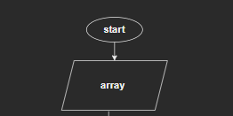
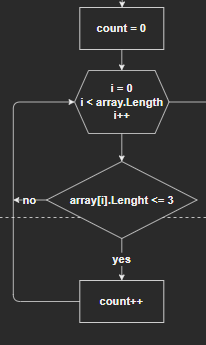
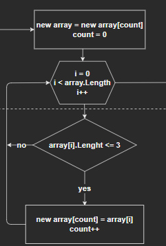
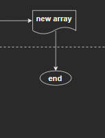
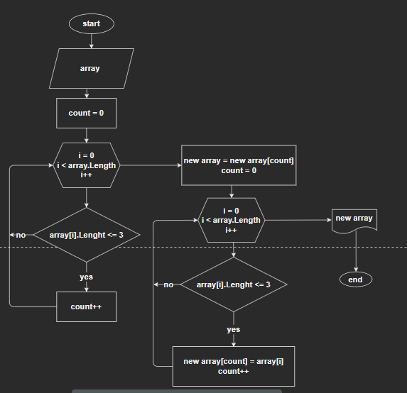
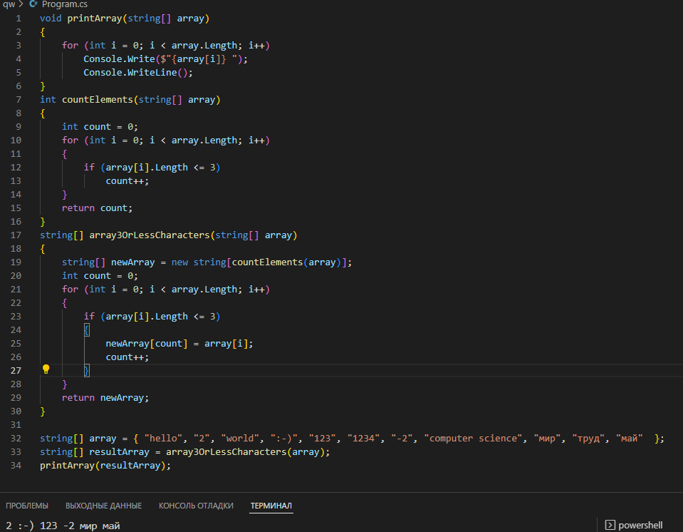

# _**Контрольная работа первая четверть**_

## *Описание действий*

1. Создать репозитарий Githab
2. Создать папку с контрольной в VS Code
3. Загрузить файл gitignore
4. Уточнить условия задачи
5. Проработка алгоритма
6. Выявить главный алгоритм
7. Нарисовать блок-схему
8. Написать код
9. Протестировать результат
10. Загрузить контрольную на  Githab

# Создание блок-схемы

* задать массив строк 

* задать счётчик и подсчитать количество элементов для конечного массива

* сформировать массив из строк, длина которых меньше либо равна 3 символа

* вывести сформированный массив

Целиком блок-схема выглядит так:

# Задача описание
Написать программу, которая из имеющегося массива строк формирует массив из строк, 
длина которых меньше либо равна 3 символа.

* заполнить массив строк текстом
* подсчитать количество элементов для конечного массива
* сформировать массив из строк, длина которых меньше либо равна 3 символа
* вывести сформированный массив

# Задача код

код программы находится в папке task файл Program
